# ESM-2 Hypergraph Mapping with Structure Prediction Analysis

This repository contains a complete hypergraph representation of the ESM-2 (Evolutionary Scale Modeling) transformer model variant `esm2_t6_8m-v1`, enhanced with comprehensive structure prediction analysis capabilities based on the landmark ESM-2 paper "Evolutionary-scale prediction of atomic level protein structure with a language model".

## 🧬 New ESM-2 Structure Prediction Capabilities

Based on the groundbreaking research showing that language models can predict protein structure directly from sequence, this repository now includes:

### 🔬 Structure Analysis
- **Attention-based contact prediction** - Extract contact maps from transformer attention patterns
- **Perplexity-structure correlation** - Analyze how language model understanding correlates with structure quality
- **Atomic resolution metrics** - TM-score, contact precision, pLDDT confidence scoring
- **Structure emergence detection** - Identify when structural information emerges in representations

### 📈 Scaling Analysis  
- **Multi-scale model comparison** - Analyze 6 model sizes from 8M to 15B parameters
- **Performance scaling trends** - Track how structure prediction improves with model scale
- **Emergence thresholds** - Detect parameter counts where capabilities emerge
- **Parameter efficiency analysis** - Measure accuracy per parameter and computational cost

### ⚡ Speed Analysis
- **ESMFold vs traditional methods** - Compare with AlphaFold2, RosettaFold
- **Speedup quantification** - Up to 60x faster structure prediction
- **MSA elimination benefits** - No multiple sequence alignment required
- **Metagenomic scalability** - Analysis of 617M+ protein feasibility

## 🧬 Hypergredient Framework Architecture

**Revolutionary formulation design system** for cosmetic ingredients optimization, implementing advanced algorithms for ingredient selection, compatibility analysis, and multi-objective formulation optimization.

### Core Capabilities

**Hypergredient Definition:**
```
Hypergredient(*) := {ingredient_i | function(*) ∈ F_i, 
                     constraints ∈ C_i, 
                     performance ∈ P_i}
```

Where:
- **F_i** = Primary and secondary functions
- **C_i** = Constraints (pH stability, temperature, interactions)  
- **P_i** = Performance metrics (efficacy, bioavailability, safety)

### 🔷 Hypergredient Classes

The system implements **10 core hypergredient classes**:

- **H.CT**: Cellular Turnover Agents (Tretinoin, Bakuchiol, Retinol)
- **H.CS**: Collagen Synthesis Promoters (Matrixyl 3000, Vitamin C, Peptides)
- **H.AO**: Antioxidant Systems (Astaxanthin, Resveratrol, Vitamin E)
- **H.BR**: Barrier Repair Complex (Ceramides, Cholesterol)
- **H.ML**: Melanin Modulators (Alpha Arbutin, Tranexamic Acid)
- **H.HY**: Hydration Systems (Hyaluronic Acid, Beta-Glucan)
- **H.AI**: Anti-Inflammatory Agents (Niacinamide, Centella Asiatica)
- **H.MB**: Microbiome Balancers (Prebiotics, Probiotics)
- **H.SE**: Sebum Regulators (Zinc, Salicylic Acid)
- **H.PD**: Penetration/Delivery Enhancers (Liposomes, Peptides)

### 🧮 Advanced Features

- **Multi-objective optimization** with configurable weights for efficacy, safety, stability, and cost
- **Real-time compatibility checking** with dynamic interaction matrix
- **Synergy calculation** based on ingredient class interactions
- **Performance prediction** using composite scoring algorithms
- **Cost-effectiveness analysis** with budget optimization
- **Safety scoring** and risk assessment
- **Stability estimation** for formulation shelf-life

## Architecture Overview

The system provides a comprehensive hypergraph representation of the ESM-2 model for analysis and visualization:


📋 **[Complete Technical Architecture Documentation](ARCHITECTURE.md)** - Detailed diagrams and system design

## Model Configuration

The hypergraph is built for the following ESM-2 model configuration:

```json
{
  "name": "esm_backbone",
  "vocabulary_size": 33,
  "num_layers": 6,
  "num_heads": 20,
  "hidden_dim": 320,
  "intermediate_dim": 1280,
  "dropout": 0,
  "max_wavelength": 10000,
  "use_bias": true,
  "activation": "gelu",
  "layer_norm_eps": 0.00001,
  "use_pre_layer_norm": false,
  "position_embedding_type": "rotary",
  "max_sequence_length": 1026,
  "pad_token_id": 1
}
```

## Hypergraph Structure

The hypergraph contains **64 nodes** and **41 hyperedges** representing the complete ESM-2 model architecture:


### Node Types:
- **Embedding** (1): Token embedding layer
- **Positional** (1): Rotary positional encoding
- **Linear** (36): Linear transformation layers (Q/K/V projections, FFN layers)
- **Attention** (6): Multi-head self-attention mechanisms
- **LayerNorm** (13): Layer normalization components
- **Activation** (6): GELU activation functions
- **Output** (1): Final output head

### Edge Types:
- **Data Flow** (11): Standard data flow connections
- **Attention Prep** (6): Preparation for attention computation
- **Attention** (6): Attention mechanism connections
- **Residual** (12): Residual connections
- **Feed Forward** (6): Feed-forward network connections

## Model Architecture Flow


## Files

### Core Implementation
- `esm2_hypergraph.py`: Core hypergraph implementation
- `hypergraph_visualizer.py`: Visualization and analysis utilities
- `hypergraph_query.py`: Query engine for hypergraph analysis
- `main.py`: Main script to generate the hypergraph
- **`hypergredient_framework.py`**: Revolutionary cosmetic formulation optimization system

### Structure Analysis Modules
- `structure_analysis.py`: ESM-2 structure prediction analysis
- `scaling_analysis.py`: Model scaling behavior analysis
- `folding_speed_analysis.py`: Speed comparison with traditional methods

### Generated Output Files
- `esm2_hypergraph.json`: Complete hypergraph data (generated)
- `hypergraph_analysis_report.md`: Detailed analysis report with mermaid diagrams (generated)
- `esm2_hypergraph.dot`: DOT file for graph visualization (generated)

### Documentation
- **[ARCHITECTURE.md](ARCHITECTURE.md)**: Comprehensive technical architecture documentation with detailed mermaid diagrams
- **[TECHNICAL_GUIDE.md](TECHNICAL_GUIDE.md)**: Implementation details, algorithms, and performance considerations  
- **[mermaid_diagrams/](mermaid_diagrams/)**: Standalone mermaid diagram files for all system components

### Utilities
- `generate_mermaid_diagrams.py`: Generate standalone mermaid diagram files

## Usage

### 🚀 Quick Start

```bash
# Generate hypergraph and run ESM-2 analysis demo
python3 main.py

# Query specific capabilities  
python3 hypergraph_query.py --query structure  # Structure prediction analysis
python3 hypergraph_query.py --query scaling    # Model scaling analysis  
python3 hypergraph_query.py --query speed      # Speed comparison analysis
python3 hypergraph_query.py --query stats      # Basic hypergraph statistics

# NEW: Hypergredient Framework queries
python3 hypergraph_query.py --query hypergredient     # Generate optimal formulation
python3 hypergraph_query.py --query compatibility     # Check ingredient compatibility  
python3 hypergraph_query.py --query ingredient --ingredient-id tretinoin  # Ingredient profile
```

### 🧬 Structure Prediction Analysis

Analyze how ESM-2 predicts protein structure from attention patterns:

```python
from structure_analysis import ESM2StructureAnalyzer
from esm2_hypergraph import create_esm2_hypergraph

# Create analyzer
config = {...}  # ESM-2 configuration
hypergraph = create_esm2_hypergraph(config)
analyzer = ESM2StructureAnalyzer(hypergraph)

# Analyze protein sequences
sequences = ["MKLLVLGLGGTAAMAAAQ...", "MEEGLLAAGGGPSPQPLP..."]
report = analyzer.generate_structure_report(sequences)

print(f"Mean TM-score: {report['aggregate_statistics']['mean_tm_score']:.3f}")
print(f"Perplexity correlation: {report['correlations']['perplexity_tm_score']:.3f}")
```

### 📈 Scaling Analysis

Study how structure prediction emerges across model scales (8M to 15B parameters):

```python
from scaling_analysis import ESM2ScalingAnalyzer

analyzer = ESM2ScalingAnalyzer()
report = analyzer.generate_scaling_report(test_sequences)

# View scaling trends
trends = report["scaling_analysis"]["scaling_trends"]
print(f"TM-score scaling: r={trends['tm_score_vs_size']['correlation']:.3f}")

# Find emergence thresholds
emergence = report["scaling_analysis"]["emergence_analysis"]
if emergence["structure_prediction_threshold"]:
    threshold = emergence["structure_prediction_threshold"]
    print(f"Structure emerges at {threshold['parameters']:,} parameters")
```

### ⚡ Speed Analysis

Compare ESMFold speed with traditional structure prediction methods:

```python
from folding_speed_analysis import ESMFoldSpeedAnalyzer

analyzer = ESMFoldSpeedAnalyzer()
report = analyzer.generate_speed_report([100, 200, 384, 500])

# View speedup factors
speedups = report["speed_comparison"]["speedup_factors"]
for method, speedup_list in speedups.items():
    for data in speedup_list:
        if data["sequence_length"] == 384:
            print(f"{method}: {data['speedup_factor']:.1f}x slower than ESMFold")

# Metagenomic scalability
meta = report["metagenomic_scalability"]
print(f"617M proteins: {meta['speedup_factor']:.1f}x faster than AlphaFold2")
```

### 🧬 Hypergredient Framework Usage

#### Generate Optimal Formulations

Create optimized cosmetic formulations using multi-objective optimization:

```python
from hypergredient_framework import HypergredientDatabase, HypergredientOptimizer, FormulationRequest

# Initialize system
database = HypergredientDatabase()
optimizer = HypergredientOptimizer(database)

# Define formulation requirements
request = FormulationRequest(
    target_concerns=['wrinkles', 'firmness'],
    secondary_concerns=['dryness', 'dullness'],
    skin_type='normal_to_dry',
    budget=800.0,
    preferences=['gentle', 'stable']
)

# Generate optimal formulation
result = optimizer.optimize_formulation(request)

print(f"Generated formulation with {len(result.selected_hypergredients)} hypergredients")
print(f"Total cost: R{result.total_cost:.2f}")
print(f"Predicted efficacy: {result.predicted_efficacy:.1%}")
print(f"Safety score: {result.safety_score:.1f}/10")
print(f"Synergy score: {result.synergy_score:.2f}")

# View selected ingredients
for class_name, data in result.selected_hypergredients.items():
    ingredient = data['ingredient']
    print(f"{class_name}: {ingredient.name} ({data['percentage']:.1f}%)")
    print(f"  Reasoning: {data['reasoning']}")
```

#### Compatibility Analysis

Check ingredient compatibility and identify potential issues:

```python
from hypergredient_framework import HypergredientDatabase, HypergredientAnalyzer

database = HypergredientDatabase() 
analyzer = HypergredientAnalyzer(database)

# Check compatibility between ingredients
ingredients = ['retinol', 'vitamin_c_laa', 'niacinamide']
report = analyzer.generate_compatibility_report(ingredients)

print("Compatibility Matrix:")
for pair, status in report['compatibility_matrix'].items():
    print(f"  {pair}: {status}")

# View warnings and recommendations
for warning in report['warnings']:
    print(f"⚠️ {warning}")
    
for rec in report['recommendations']:
    print(f"✅ {rec}")
```

#### Ingredient Profiling

Get detailed profiles for individual hypergredients:

```python
# Get comprehensive ingredient analysis
profile = analyzer.generate_ingredient_profile('bakuchiol')

print(f"Ingredient: {profile['basic_info']['name']}")
print(f"Class: {profile['basic_info']['class']}")
print(f"Primary Function: {profile['basic_info']['primary_function']}")
print(f"Efficacy Score: {profile['performance_metrics']['efficacy_score']}/10")
print(f"Safety Score: {profile['performance_metrics']['safety_score']}/10")
print(f"Cost Efficiency: {profile['derived_metrics']['cost_efficiency']}")
print(f"Clinical Evidence: {profile['derived_metrics']['clinical_evidence']}")
```

#### CLI Usage Examples

```bash
# Generate anti-aging formulation with budget optimization
python3 hypergraph_query.py --query hypergredient

# Check compatibility between multiple ingredients
python3 hypergraph_query.py --query compatibility

# Get detailed profile for specific ingredient
python3 hypergraph_query.py --query ingredient --ingredient-id tretinoin
python3 hypergraph_query.py --query ingredient --ingredient-id bakuchiol
python3 hypergraph_query.py --query ingredient --ingredient-id niacinamide
```

#### Available Hypergredients

The database includes proven ingredients across all classes:

**H.CT (Cellular Turnover):** Tretinoin, Bakuchiol, Retinol, Retinyl Palmitate
**H.CS (Collagen Synthesis):** Matrixyl 3000, Argireline, Copper Peptides, Vitamin C
**H.AO (Antioxidants):** Astaxanthin, Resveratrol, Vitamin E, Ferulic Acid, CoQ10
**H.ML (Melanin Modulators):** Alpha Arbutin, Tranexamic Acid, Kojic Acid
**H.HY (Hydration):** Hyaluronic Acid, Beta-Glucan, Glycerin
**H.AI (Anti-Inflammatory):** Niacinamide, Centella Asiatica, Zinc

Each ingredient includes comprehensive data on efficacy, safety, stability, cost, pH ranges, and interactions.

### Generate Hypergraph

```bash
python3 main.py
```

This creates:
- `esm2_hypergraph.json`: Full hypergraph data structure
- `hypergraph_analysis_report.md`: Comprehensive analysis report with mermaid diagrams
- `esm2_hypergraph.dot`: Graph visualization file
- Structure/scaling/speed analysis demo reports

### Generate Standalone Mermaid Diagrams

```bash
python3 generate_mermaid_diagrams.py
```

This creates a `mermaid_diagrams/` directory with:
- Individual `.mmd` files for each diagram type
- Combined `all_diagrams.md` with all diagrams
- `README.md` with usage instructions

### Query Hypergraph

The query engine provides various analysis capabilities:

```mermaid
flowchart LR
    A[Query Request] --> B{Query Type}
    
    B -->|stats| C[Get Statistics<br/>Nodes, Edges, Types]
    B -->|attention| D[Analyze Attention<br/>Structure & Patterns] 
    B -->|params| E[Parameter Flow<br/>Analysis]
    B -->|bottlenecks| F[Find Bottlenecks<br/>High Fan-in/out]
    B -->|path| G[Find Computational<br/>Path A→B]
    B -->|subgraph| H[Extract Layer<br/>Subgraph]
    B -->|structure| I[🧬 Structure Prediction<br/>Analysis]
    B -->|scaling| J[📈 Model Scaling<br/>Analysis]
    B -->|speed| K[⚡ Speed Comparison<br/>Analysis]
    
    C --> L[JSON Output]
    D --> L
    E --> L
    F --> L
    I --> L
    J --> L
    K --> L
    G --> M[Path Visualization]
    H --> N[Subgraph Export]
```


    B -->|subgraph| H[Extract Layer<br/>Subgraph]
    
    C --> I[JSON Output]
    D --> I
    E --> I
    F --> I
    G --> J[Path Visualization]
    H --> K[Subgraph Export]
```

```bash
# Get basic statistics
python3 hypergraph_query.py --query stats

# Analyze attention structure
python3 hypergraph_query.py --query attention

# Analyze parameter distribution
python3 hypergraph_query.py --query params

# Find bottlenecks
python3 hypergraph_query.py --query bottlenecks

# Find computational path between nodes
python3 hypergraph_query.py --query path --start token_embedding --end output_head

# Export subgraph for specific layers
python3 hypergraph_query.py --query subgraph --layer-start 0 --layer-end 2

# NEW: Structure prediction analysis
python3 hypergraph_query.py --query structure

# NEW: Model scaling analysis (8M to 15B parameters)
python3 hypergraph_query.py --query scaling

# NEW: Speed comparison analysis (ESMFold vs AlphaFold/RosettaFold)
python3 hypergraph_query.py --query speed
```

### Visualize Graph

Generate PNG visualization from DOT file:

```bash
dot -Tpng esm2_hypergraph.dot -o esm2_hypergraph.png
```

## Model Architecture Summary

```
INPUT LAYER:
  Token Embedding (vocab=33 -> hidden=320)
  Rotary Positional Encoding

TRANSFORMER LAYERS (6x):
  Multi-Head Self-Attention:
    - Query/Key/Value Projections (320 -> 320)
    - 20 attention heads, head dimension: 16
    - Output Projection
    - Residual Connection
  Post-Attention Layer Norm
  Feed-Forward Network:
    - Linear (320 -> 1280)
    - GELU Activation
    - Linear (1280 -> 320)
    - Residual Connection
  Post-FFN Layer Norm

OUTPUT LAYER:
  Final Layer Norm
  Output Head
```

## Parameter Count

Total parameters: **7,400,640**

- Embedding layer: 10,560 parameters
- Each transformer layer: 1,231,680 parameters
- 6 transformer layers: 7,390,080 parameters

## Requirements

No external dependencies required for basic functionality. Optional dependencies for enhanced visualization are listed in `requirements.txt`.

## Features

### ESM-2 Hypergraph Analysis
- **Complete Model Mapping**: Every component of the ESM-2 model is represented as nodes and hyperedges
- **Hypergraph Structure**: Uses hyperedges to represent complex multi-input/multi-output relationships
- **Query Engine**: Powerful query capabilities for analysis and exploration
- **Visualization**: Multiple visualization formats including DOT graphs and text-based diagrams
- **Parameter Analysis**: Detailed parameter counting and distribution analysis
- **Path Finding**: Computational path discovery between any two nodes
- **Subgraph Extraction**: Export specific portions of the hypergraph

### Structure Prediction Capabilities
- **Attention-based Contact Prediction**: Extract structural information from transformer attention
- **Perplexity-Structure Correlation**: Analyze language model understanding vs structure quality
- **Scaling Analysis**: Track capability emergence across model sizes (8M to 15B parameters)
- **Speed Benchmarking**: Compare ESMFold with AlphaFold2 and RosettaFold
- **Metagenomic Analysis**: Evaluate feasibility for large-scale protein analysis

### 🧬 Hypergredient Framework
- **Multi-Objective Optimization**: Balance efficacy, safety, stability, and cost in formulations
- **Real-Time Compatibility Analysis**: Detect ingredient interactions and incompatibilities
- **Dynamic Database**: 10 hypergredient classes with comprehensive ingredient data
- **Synergy Calculation**: Advanced algorithms for ingredient combination optimization
- **Performance Prediction**: Estimate formulation efficacy and safety scores
- **Cost Optimization**: Budget-aware formulation generation with cost-effectiveness analysis
- **Safety Assessment**: Risk-benefit analysis with detailed safety scoring

## API Reference

### Component Architecture


### ESM2Hypergraph Class

Main class representing the hypergraph:

- `create_esm2_hypergraph(config)`: Factory function to create hypergraph
- `get_statistics()`: Get hypergraph statistics
- `to_dict()`: Convert to dictionary representation
- `save_to_json(filepath)`: Save to JSON file
- `visualize_summary()`: Generate text summary

### HypergraphQueryEngine Class

Query engine for analysis:

- `find_nodes_by_type(node_type)`: Find nodes by type
- `find_nodes_by_layer(layer_idx)`: Find nodes by layer
- `get_node_dependencies(node_id)`: Get node dependencies
- `get_computational_path(start, end)`: Find path between nodes
- `analyze_parameter_flow()`: Analyze parameter distribution

This hypergraph representation provides a comprehensive view of the ESM-2 model's computational structure, enabling detailed analysis and understanding of the model architecture.
