# ESM-2 Hypergraph Mapping

This repository contains a complete hypergraph representation of the ESM-2 (Evolutionary Scale Modeling) transformer model variant `esm2_t6_8m-v1`. The hypergraph maps the full computational structure of the model, including all layers, attention mechanisms, feed-forward networks, and their interconnections.

## Architecture Overview

The system provides a comprehensive hypergraph representation of the ESM-2 model for analysis and visualization:


📋 **[Complete Technical Architecture Documentation](ARCHITECTURE.md)** - Detailed diagrams and system design

## Model Configuration

The hypergraph is built for the following ESM-2 model configuration:

```json
{
  "name": "esm_backbone",
  "vocabulary_size": 33,
  "num_layers": 6,
  "num_heads": 20,
  "hidden_dim": 320,
  "intermediate_dim": 1280,
  "dropout": 0,
  "max_wavelength": 10000,
  "use_bias": true,
  "activation": "gelu",
  "layer_norm_eps": 0.00001,
  "use_pre_layer_norm": false,
  "position_embedding_type": "rotary",
  "max_sequence_length": 1026,
  "pad_token_id": 1
}
```

## Hypergraph Structure

The hypergraph contains **64 nodes** and **41 hyperedges** representing the complete ESM-2 model architecture:


### Node Types:
- **Embedding** (1): Token embedding layer
- **Positional** (1): Rotary positional encoding
- **Linear** (36): Linear transformation layers (Q/K/V projections, FFN layers)
- **Attention** (6): Multi-head self-attention mechanisms
- **LayerNorm** (13): Layer normalization components
- **Activation** (6): GELU activation functions
- **Output** (1): Final output head

### Edge Types:
- **Data Flow** (11): Standard data flow connections
- **Attention Prep** (6): Preparation for attention computation
- **Attention** (6): Attention mechanism connections
- **Residual** (12): Residual connections
- **Feed Forward** (6): Feed-forward network connections

## Model Architecture Flow


## Files

### Core Implementation
- `esm2_hypergraph.py`: Core hypergraph implementation
- `hypergraph_visualizer.py`: Visualization and analysis utilities
- `hypergraph_query.py`: Query engine for hypergraph analysis
- `main.py`: Main script to generate the hypergraph

### Generated Output Files
- `esm2_hypergraph.json`: Complete hypergraph data (generated)
- `hypergraph_analysis_report.md`: Detailed analysis report with mermaid diagrams (generated)
- `esm2_hypergraph.dot`: DOT file for graph visualization (generated)

### Documentation
- **[ARCHITECTURE.md](ARCHITECTURE.md)**: Comprehensive technical architecture documentation with detailed mermaid diagrams
- **[TECHNICAL_GUIDE.md](TECHNICAL_GUIDE.md)**: Implementation details, algorithms, and performance considerations  
- **[mermaid_diagrams/](mermaid_diagrams/)**: Standalone mermaid diagram files for all system components

### Utilities
- `generate_mermaid_diagrams.py`: Generate standalone mermaid diagram files

## Usage

### Generate Hypergraph

```bash
python3 main.py
```

This creates:
- `esm2_hypergraph.json`: Full hypergraph data structure
- `hypergraph_analysis_report.md`: Comprehensive analysis report with mermaid diagrams
- `esm2_hypergraph.dot`: Graph visualization file

### Generate Standalone Mermaid Diagrams

```bash
python3 generate_mermaid_diagrams.py
```

This creates a `mermaid_diagrams/` directory with:
- Individual `.mmd` files for each diagram type
- Combined `all_diagrams.md` with all diagrams
- `README.md` with usage instructions

### Query Hypergraph

The query engine provides various analysis capabilities:

```mermaid
flowchart LR
    A[Query Request] --> B{Query Type}
    
    B -->|stats| C[Get Statistics<br/>Nodes, Edges, Types]
    B -->|attention| D[Analyze Attention<br/>Structure & Patterns] 
    B -->|params| E[Parameter Flow<br/>Analysis]
    B -->|bottlenecks| F[Find Bottlenecks<br/>High Fan-in/out]
    B -->|path| G[Find Computational<br/>Path A→B]
    B -->|subgraph| H[Extract Layer<br/>Subgraph]
    
    C --> I[JSON Output]
    D --> I
    E --> I
    F --> I
    G --> J[Path Visualization]
    H --> K[Subgraph Export]
```



```bash
# Get basic statistics
python3 hypergraph_query.py --query stats

# Analyze attention structure
python3 hypergraph_query.py --query attention

# Analyze parameter distribution
python3 hypergraph_query.py --query params

# Find bottlenecks
python3 hypergraph_query.py --query bottlenecks

# Find computational path between nodes
python3 hypergraph_query.py --query path --start token_embedding --end output_head

# Export subgraph for specific layers
python3 hypergraph_query.py --query subgraph --layer-start 0 --layer-end 2
```

### Visualize Graph

Generate PNG visualization from DOT file:

```bash
dot -Tpng esm2_hypergraph.dot -o esm2_hypergraph.png
```

## Model Architecture Summary

```
INPUT LAYER:
  Token Embedding (vocab=33 -> hidden=320)
  Rotary Positional Encoding

TRANSFORMER LAYERS (6x):
  Multi-Head Self-Attention:
    - Query/Key/Value Projections (320 -> 320)
    - 20 attention heads, head dimension: 16
    - Output Projection
    - Residual Connection
  Post-Attention Layer Norm
  Feed-Forward Network:
    - Linear (320 -> 1280)
    - GELU Activation
    - Linear (1280 -> 320)
    - Residual Connection
  Post-FFN Layer Norm

OUTPUT LAYER:
  Final Layer Norm
  Output Head
```

## Parameter Count

Total parameters: **7,400,640**

- Embedding layer: 10,560 parameters
- Each transformer layer: 1,231,680 parameters
- 6 transformer layers: 7,390,080 parameters

## Requirements

No external dependencies required for basic functionality. Optional dependencies for enhanced visualization are listed in `requirements.txt`.

## Features

- **Complete Model Mapping**: Every component of the ESM-2 model is represented as nodes and hyperedges
- **Hypergraph Structure**: Uses hyperedges to represent complex multi-input/multi-output relationships
- **Query Engine**: Powerful query capabilities for analysis and exploration
- **Visualization**: Multiple visualization formats including DOT graphs and text-based diagrams
- **Parameter Analysis**: Detailed parameter counting and distribution analysis
- **Path Finding**: Computational path discovery between any two nodes
- **Subgraph Extraction**: Export specific portions of the hypergraph

## API Reference

### Component Architecture


### ESM2Hypergraph Class

Main class representing the hypergraph:

- `create_esm2_hypergraph(config)`: Factory function to create hypergraph
- `get_statistics()`: Get hypergraph statistics
- `to_dict()`: Convert to dictionary representation
- `save_to_json(filepath)`: Save to JSON file
- `visualize_summary()`: Generate text summary

### HypergraphQueryEngine Class

Query engine for analysis:

- `find_nodes_by_type(node_type)`: Find nodes by type
- `find_nodes_by_layer(layer_idx)`: Find nodes by layer
- `get_node_dependencies(node_id)`: Get node dependencies
- `get_computational_path(start, end)`: Find path between nodes
- `analyze_parameter_flow()`: Analyze parameter distribution

This hypergraph representation provides a comprehensive view of the ESM-2 model's computational structure, enabling detailed analysis and understanding of the model architecture.
